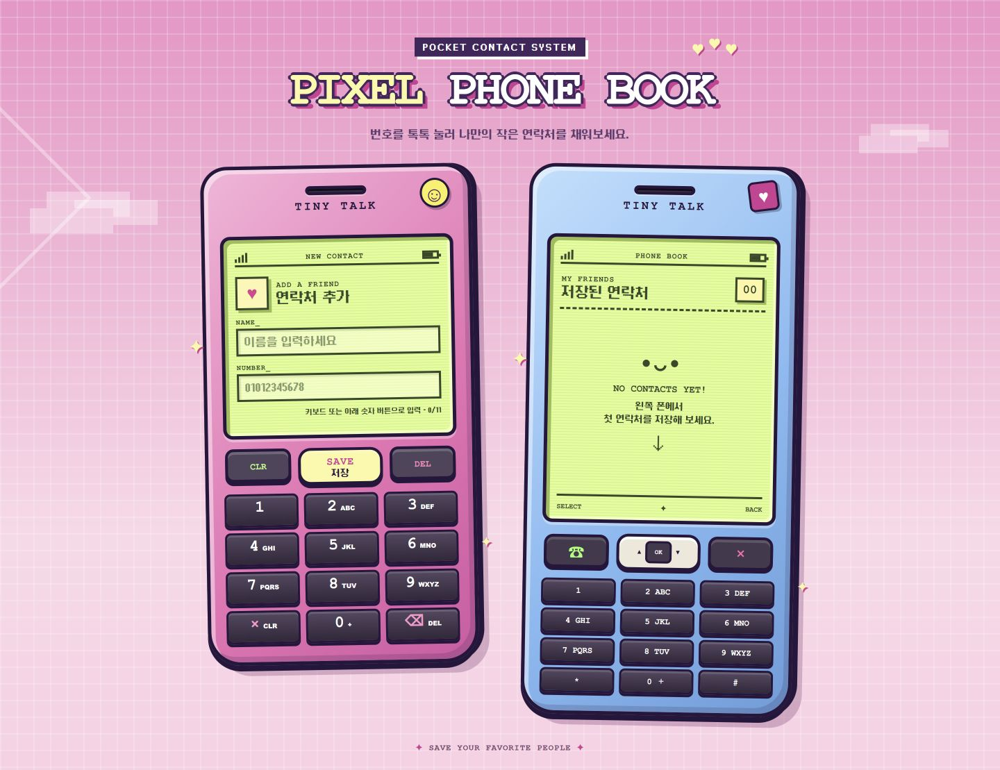

<h1>📟 픽셀 전화번호부</h1>

<strong>레트로 픽셀 피처폰 디자인으로 만든 연락처 관리 애플리케이션</strong>

이름과 전화번호를 저장하고, 실제 휴대폰처럼 화면 속 숫자 키패드로 번호를 입력할 수 있습니다.

<a href="https://pixel-phonebook.netlify.app/">🌐 배포 사이트 바로가기</a>

---

## 배포 주소

[https://pixel-phonebook.netlify.app/](https://pixel-phonebook.netlify.app/)

## 실행 화면

## 프로젝트 소개

픽셀 전화번호부(Pixel Phone Book)는 React와 Zustand를 학습하며 만든 연락처 관리 프로젝트입니다.

단순한 입력 폼과 목록에서 벗어나 레트로 피처폰과 8비트 게임 화면을 모티브로 디자인했습니다. 두 대의 픽셀 휴대폰 안에서 연락처 등록, 조회, 수정, 삭제가 모두 이루어집니다.

## 주요 기능

### 연락처 등록

- 이름과 전화번호를 입력해 연락처 저장
- 키보드 입력과 화면 속 숫자 키패드 입력 지원
- 전화번호에는 숫자만 입력되며 최대 11자리까지 제한
- **전체 삭제(CLR)** 버튼으로 모든 숫자 삭제, **한 자리 삭제(DEL)** 버튼으로 마지막 숫자 삭제
- 저장 완료 후 입력창 자동 초기화

### 연락처 조회

- 가장 최근에 등록한 연락처를 목록 위쪽에 표시
- 연락처 개수를 LCD 화면에서 실시간 확인
- 10자리와 11자리 전화번호에 하이픈 자동 적용
- 연락처가 추가될 때 아래에서 올라오는 픽셀 애니메이션 실행
- 목록이 길어지면 휴대폰 화면 내부에서 스크롤

### 연락처 수정 및 삭제

- 각 연락처의 **수정(EDIT)** 버튼을 눌러 이름과 전화번호 수정
- 수정 중인 카드가 액정 화면 안의 편집 화면으로 전환
- **저장(SAVE) / 취소(CANCEL)** 버튼으로 수정 내용 저장 또는 취소
- **삭제(DEL)** 버튼을 누르면 **예(YES) / 아니요(NO)** 확인 단계 표시
- Zustand 저장소의 데이터를 불변성을 유지하며 수정·삭제

### 픽셀 화면 디자인과 사용 경험

- 핑크색 등록용 휴대폰과 파란색 목록용 휴대폰을 나란히 배치
- LCD 화면, 배터리, 통신 신호, 스피커, 물리 키패드 표현
- 굵은 외곽선, 계단식 그림자, 격자 배경과 픽셀 장식 적용
- 버튼을 눌렀을 때 실제 키처럼 내려가는 인터랙션
- 820px 이하에서는 휴대폰이 한 줄씩 배치되는 반응형 레이아웃
- 모션 감소 설정을 사용하는 환경에서는 애니메이션 최소화

## 사용 흐름

~~~text
이름·전화번호 입력
        ↓
ContactForm에서 addContact 실행
        ↓
Zustand phoneBook 상태 변경
        ↓
ContactList 자동 재렌더링
        ↓
수정(updateContact) 또는 삭제(deleteContact)
~~~

ContactForm 내부의 입력값은 해당 컴포넌트에서만 사용하는 지역 상태로 관리합니다. 여러 컴포넌트가 함께 사용하는 연락처 목록은 Zustand 저장소에서 전역 상태로 관리합니다.

## 기술 스택

| 구분 | 기술 | 사용 목적 |
| --- | --- | --- |
| 화면 구성 | React 19 | 컴포넌트 구성과 화면 렌더링 |
| 상태 관리 | Zustand 5 | 연락처 등록·수정·삭제 상태 공유 |
| 스타일 | CSS3 | 픽셀 아트, 애니메이션, 반응형 UI |
| 개발 환경 | Vite 8 | 개발 서버와 프로덕션 빌드 |
| 코드 검사 | ESLint | 코드 품질과 문법 검사 |

## 프로젝트 구조

~~~text
src/
├─ components/
│  ├─ ContactForm.jsx       # 연락처 입력과 숫자 키패드
│  └─ ContactList.jsx       # 연락처 목록, 수정, 삭제
├─ stores/
│  └─ usePhonbookStore.js   # Zustand 연락처 상태와 액션
├─ App.jsx                  # 전체 화면 구조
├─ App.css                  # 픽셀 디자인과 애니메이션
├─ index.css                # 전역 루트 스타일
└─ main.jsx                 # React 애플리케이션 진입점
~~~

## 실행 방법

저장소를 내려받은 뒤 프로젝트 폴더에서 아래 명령어를 실행합니다.

~~~bash
npm install
npm run dev
~~~

프로덕션 빌드는 다음 명령어로 확인할 수 있습니다.

~~~bash
npm run build
~~~

코드 검사는 다음 명령어를 사용합니다.

~~~bash
npm run lint
~~~

## 핵심 구현 내용

### 1. 키보드와 숫자 키패드의 입력값 통일

키보드 입력과 버튼 입력 모두 같은 phoneNumber 상태를 변경합니다. 키보드로 문자나 하이픈을 입력해도 숫자만 남기므로 두 입력 방식의 데이터 형태가 일치합니다.

### 2. Zustand 기반 등록·조회·수정·삭제(CRUD)

연락처 배열은 ContactForm과 ContactList가 함께 사용하므로 Zustand 저장소에서 관리합니다. 배열을 직접 변경하지 않고 전개 구문(spread), map, filter를 사용해 새 배열을 반환합니다.

- addContact: 새 연락처 추가
- updateContact: 선택한 id의 연락처 수정
- deleteContact: 선택한 id의 연락처 삭제

### 3. 조건부 렌더링을 이용한 편집 화면

editingId와 deleteTargetId를 기준으로 일반 카드, 수정 폼, 삭제 확인 화면을 조건부 렌더링합니다. 별도의 페이지로 이동하지 않고 휴대폰 LCD 화면 안에서 모든 작업을 완료할 수 있습니다.

### 4. CSS 픽셀 애니메이션

새 연락처가 렌더링될 때 translateY, scale, opacity를 조합한 애니메이션을 적용했습니다. cubic-bezier를 사용해 카드가 아래에서 올라온 뒤 살짝 튀는 느낌을 만들었습니다.

## 현재 데이터 저장 방식

연락처는 현재 Zustand 메모리에 저장됩니다. 따라서 **페이지를 새로고침하면 등록한 연락처가 초기화됩니다.**

브라우저에 데이터를 계속 보관하려면 이후 Zustand persist 미들웨어 또는 localStorage를 연결할 수 있습니다.

## 향후 개선 사항

- Zustand persist를 이용한 연락처 영구 저장
- 이름과 전화번호 검색 기능
- 즐겨찾기 및 연락처 정렬 기능
- 연락처 프로필 이미지 등록
- 컴포넌트 테스트와 store 단위 테스트 추가

---

<strong>소중한 사람들을 저장해 보세요 ✦</strong>

